# **Artist For Life**

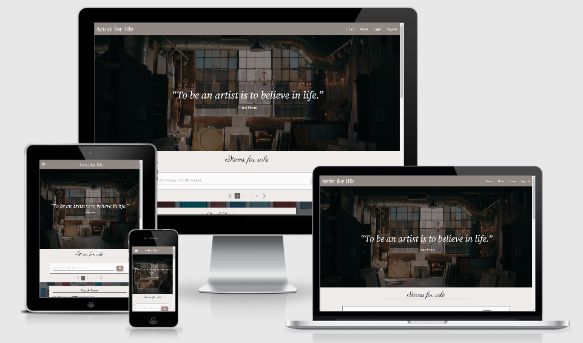

## TABLE OF CONTENT 
* [Introduction](#introduction)    
* [UX](#ux)
    * [UX design work](#ux-design-work)
    * [Colour scheme](#colour-scheme)
    * [Typography](#typography)
* [Development cycle](#development-cycle)
* [Features](#features)
    * [Navbar](#navbar)
    * [Modals](#modals)
    * [search bar and pagination](#search-bar-and-pagination) 
    * [Profile page](#profile-page)
    * [Control center](#control-center)
    * [Side navigation](#side-navigation)
    * [Sold feature](#sold-feature)
    * [Flash messages](#flash-messages)
    * [Footer](#footer)
* [Technologies used](#technologies-used)
* [Images](#images)
* [Data schema](#data-schema)
    * [CRUD operations](#crud-operations)
    * [CRUD authorisation](#crud-authorisation)    
* [Testing](#testing)
    * [UX testing](#ux-testing)
    * [validators](#validators)
    * [Chrome DevTools](#chrome-devtools)    
    * [Site testing](#site-testing)
    * [Responsive design](#responsive-design)
    * [Browser compatibility](#browser-compatibility)
    * [Button and link testing](#button-and-link-testing) 
    * [Crud operation testing](#crud-operation-testing)    
    * [Issues encountered during development](#issues-encountered-during-development)

* [Deployment](#deployment)
* [Future improvments](#future-improvements)
* [Credits](#credits)

## INTRODUCTION 

This site has was created as a product listing site with the intention of providing a service for artist to showcase 
their art work to potential buyers and other ethusiasts in the Mauritian market. 

The site would permit the registered users to upload and manage their items while also creating a profile page. Thus providing 
the user with the power of creating, updating and modifying their items by using a database system. 

## UX 

By visiting this site as a user I want to:
* be able to easily understand what the site is about inorder to see if it is of interest to me. 
* have a user friendly register/login process inorder to start using the site.  
* be able to upload my item information with ease inorder for buyers to view them.
* be provided with an option to upload my personal information so potential buyers can see who I am.
* be able to edit and delete all uploaded information if any changes need to be made.
* be able to tag an item as sold so as the buyers can see how in demand my works are.

By visiting this site as a buyer I want to:

* have information about the item being sold in one place for convenience of use.
* have the ability to view items by search criteria inorder to narrow down item list to specific requirements.

By using this site as the site owner:

* be able to edit and delete any loaded information for content control purposes.
* have full access to all uploaded information in one convenient place for CRUD operations.

### UX design work 

The following provides an overview of the site layout and logic behind design choices.

A wireframe was constructed using balsamique wireframes. It can be found [here](assets/doc/wireframe.pdf).

The site was designed to have an artistic atmosphere by by making use of hero image reflecting an artist studio with 
suitable banner text. 

Modals were the preferred chose for login and registration since was more visually appealing.

Also the site implemented several features to make registration, login, adding items and profiles as user friendly and 
intuitive as possible. 

Flash messages were included so as to enable the user obtain feedback on whether actions had been completed. The messages
were made to disappear after 5's since the messages were of temporary nature.

A search bar was then provided inbetween hero image and items list as it would provide filter options all listed item. This
was situated above the items list.

The items section was placed next and consisted of using a card display divided into image and desciption sections providing
all the nessary info about the item in one place. 

An item list was situated on the right for devices having a screen size large or higher to provide a scroll function to specific
item names.

The profile page consisted of the seller profile information followed by all items the seller has listed in one convenient place.
This was thought to improve UX since it would be a be able to showcase all works by the user to potential buyers.

For the site owner a control center page ws included to allow for centralised place where all CRUD functions could be performed.

All features are described in detail [below](#features).

### Colour Scheme 

Several colour schemes were tested and the following palette was finally adopted since it was thought to fit into the overall site theme.

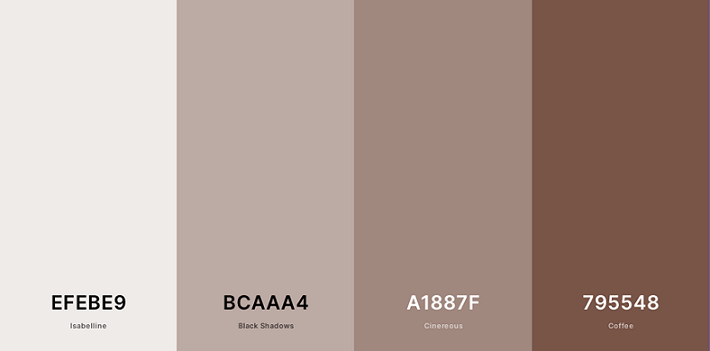

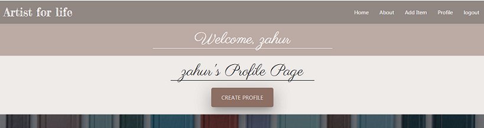

All button were also designed to have an identical colour scheme for easy identification.

### Typography

Font were obtained from [google font](https://fonts.google.com/) and consisted of the following:
- 'Fredericka the Great ws used for logo, login/registration header and flash messages.
- 'Parisienne' used all page headers
- 'Lora' was used for flash messages
- 'Source Serif Pro' used for banner text
- Roboto

## DEVELOPMENT CYCLE

The main development cycle is listed below:

1. Site design work making use of sketch pad and balsamique.
2. Database design (field definition) and creation using mongodb.
3. Coding of base html page with header, footer and navbar.
4. Programming of item page.
5. Coding of registration and login modal in base html page.
6. Coding of logout function.
7. Coding of profile page.
8. Coding of add/edit/delete items funcitons.
9. Coding of add/edit/delete profile funcitons.
10. Coding of control center functions.
11. Coding of add/edit/delete categories funcitons.
12. Mid Project Review.
13. Implementation of pagination for items page.
14. Implementation of search bar on items page with pagination.
15. Restructuring of profile page.
16. Restructuring of registration modal to allow for email and phone input.
17. Modifications to add/edit items page due to modification above.
16. Creation of about modal.
17. Coding of sold fucntion.
18. Final project testing and adjustments.

## FEATURES

This section gives details of the features included and their function.

### Navbar

A standard navbar was used which was obtained from materialize to allow navigation between the
different pages and was made to collapse on medium and down devices.

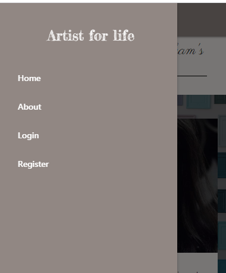

### Modals

During site design it was decided to use modals for registration and login instead of having seperate pages. This was 
thought to improve the overall site experience since login could be done from the main page. Modals could be 
interchanged with a click here button and would reopen if data submitted did not meet the login/registration criteria. 

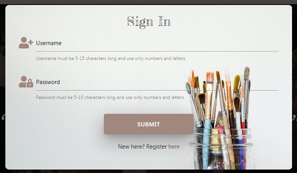

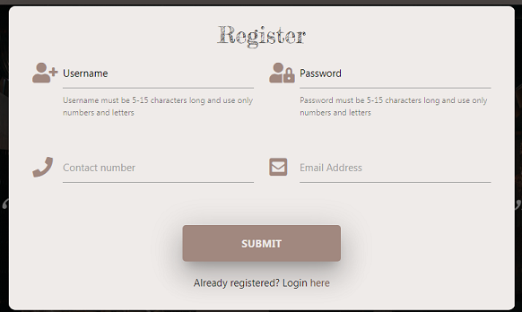

A third modal was also used for the about section.

### Search bar and pagination

Search bar and pagination features were included in the site. These functions were not originally planned and were  
were included after mid project review since it was thought to be good practice for such a site where item quantity 
could be significant. The inclusion was thought to improve UX. The search criteria used were:
1. seller name
2. category
3. description

These criterion were suitable enought to narrow down the item list significantly whilst offering the user broad search requirements.

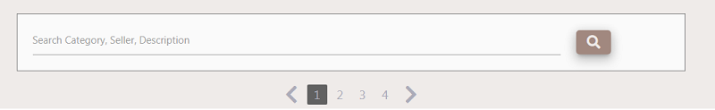

### Item cards

The item was displayed on cards and divided into two areas, one for item image and the other for item description.
All information on the item was located in one place for convenience and the image could be enlarged by clicking 
on them by making use of materialize media box.

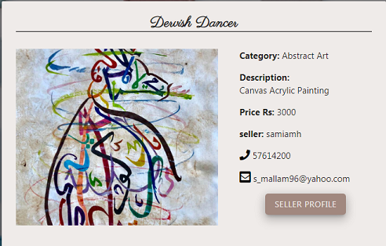

The card also had a link to the profile page of the seller if the buyer wished to obtain further information. Edit and
delete item buttons were also included on the card to provide conevenient place for the item owner to make modifications.

### Profile page

A user profile page was included which permitted the user to upload a profile pic and provide a description about themselves
so a buyer could obtain more details about the person. This feature was made to be optional.

This page also provided the profile user and buyer with and centralised page where all the profile users items would be listed in a 
convenient way. 

The items could be modified and deleted at will by the profile user instead of having to search for each individual item 
on the main page hence improving the user interface.

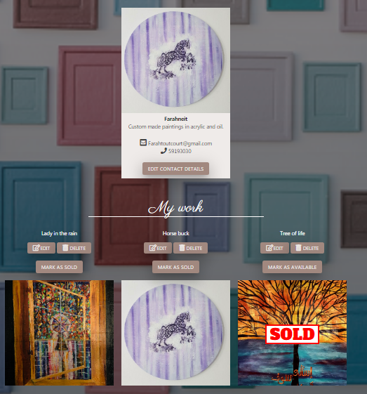

### Control center

A control center page was included for only for the admin. This page listed all registered users, items and categories for the admin
to have access to in one convenient place. This page was used for control purposes were all modifications could be made instead of having 
to search for each individual user and items. 

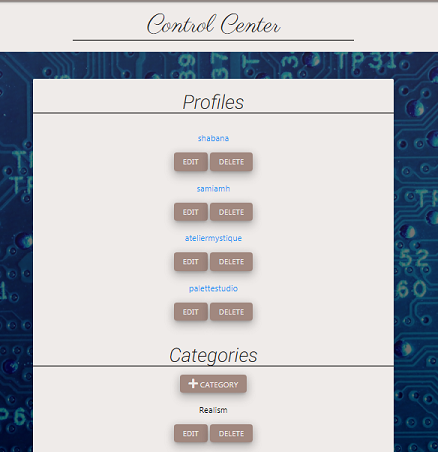

### Side navigation

A side navigation menu was added on large screen and higher devices. This permitted the user to scroll to items by
name and was added to improve user experience.

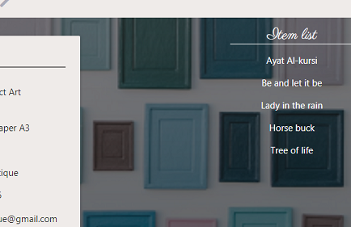

### Sold feature

The profile page also included a sold feature whereby the item could be listed as sold instead of deleting them and could be used
as a marketing tool indicating that the seller items were in demand.

Once the item sold feature was activated this would remove the item from items list on the main page.

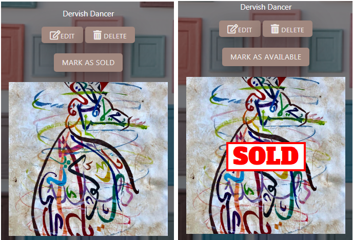

### Flash messages

Flash messages were used when ever a CRUD operation was performed. This would provide confirmation to the user
that the operation had been completed and the database had been updated.

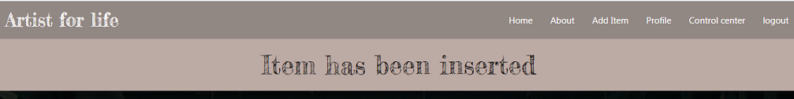

### footer

A basic footer was provided with a link to wikipedia containing a list of art museums.

## TECHNOLOGIES USED

* HTML5
* css 
* javacript (ES6)
* python 
* flask for the web framework
* mongodb to store data 
* Jquery to simplify DOM manipulation
* pylint for python syntax
* official W3C validator to check HTML syntax
* css official validator(jigsaw) to check css syntax
* JSHint to check javacript syntax 
* Chrome developers tools for analysing scripts and debugging
* Materilize 1.0.0 for :
    1. page layout purposes and responsive design aspects
    2. Forms 
    3. Modals
    4. Scrollspy
    5. Materialized media box
    6. Navbar
    7. Footer
* balsamiq wireframes application to create the site design
* Chrome extension 'responsive viewer' to aid in reponsive design 

## Images 

A important part of the website design process was the means by which the user would provide images to the site. 
From the outset it was decided to allow the user to upload images instead of the user providing a URL. This was thought to 
improve the overall site experience since it would be much more convenient for the user. 

A tutorial on how to upload images into mongodb database was sought and is located [here](https://www.youtube.com/watch?v=DsgAuceHha4)

Mongodb BSON documents allowed the storage of images and was capped at 16mb. This was thought to be sufficient for the
intended use. A helper text when uploading images was added stating a lower limit of 10mb. 

Images which were deleted had there correspoding fs.files and fs.chunks removed for house cleaning purposes since the database was 
of limited size.

## Data schema 

Mongodb was used for database storage since this type of non relational database was well suited for storing user and
item details which contained information of different formats. Information could be displayed faster since a query doesn’t 
have to view several tables in order to deliver an answer, this was well suited for the items collections.

Also flexible schema offered by mongodb was thought to be advantageous in the likely event that new fields would need to be
added in the future.

The main database contained 4 collections:

| Collections         |   Fields                                                           |
|:--------------------|:-------------------------------------------------------------------|
|User                 |  Username, Password, contact number, email                         |                                     |    
|Profile              |  Username, profile image, fullname, profile description            |
|Items                |  Category, image, name, description, price, username, sold         |             
|Categories           |  Category name                                                     |            

The user collection was used for registration and login purposes. The contact number and email fields were
added to this collection instead of the items collection since it would only have to be entered once and would remain
constant for that user. This would also prevent the user from having to add contact info with each item upload.
The username would be used as seller name.

The profile collection was used to provide additional information on the seller and was purposely given its own 
collection since it was an option and could be independantly edited without affecting other collections. 

The items collections consisted of all the required information about the item being sold for a buyer to see. 

Categories collections consisted of seven main painting categories and was made to be independant.

The user, profile and items collections had a matching field of 'username' which was used as a common reference. This was
done to links documents where common information about a user needed to displayed. One such page which made use of this 
reference was the profile page.

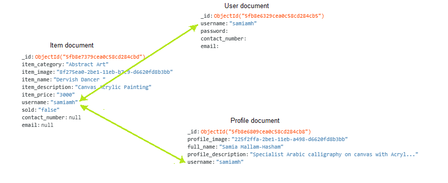

### CRUD operations

CRUD operations were essential for the running of the site and were provided for the following features:

| Feature             |   Create   |   Read    |  Update  |  Delete  |  Mongodb collection | 
|:--------------------|:-----------|:----------|:---------|:---------|:--------------------|
|User registration    |  &#9745;   |           |  &#9745; |          | Users               |   
|User login           |            |  &#9745;  |          |          | Users               |
|User items           |  &#9745;   |  &#9745;  |  &#9745; |  &#9745; | Items               |             
|User Profile         |  &#9745;   |  &#9745;  |  &#9745; |  &#9745; | Profile             |            
|Item sold            |  &#9745;   |  &#9745;  |  &#9745; |          | Items               |
|Category             |  &#9745;   |  &#9745;  |  &#9745; |  &#9745; | Category            |

The update operation for the registration feature was for the contact information fields only. 

### CRUD authorisation

A user would have authorisation to update and delete any information uploaded by themselves except for the their username,
and password.

The admin would have authorisation to update and delete all uploaded user information present in the database.
This was done so as the admin has control on what information was being displayed on the site.

## TESTING 

This section provides details of testing performed during development. The following table highlights the different stages when testing were carried out:

| Test                | Stage Performed                                  | Tool used                                     |
|---------------------|:-------------------------------------------------|:----------------------------------------------|
|Syntax errors        |Once During mid development and on completion     |W3C validator, css validator(jigsaw), jshint   |
|Debugging            |During the whole project                          |Chrome Devtools                                |
|Reponsive design     |During the whole project                          |Chrome Devtools and reposnsive viewer extension|
|Site testing         |As from when main site was completed              |By myself and relatives                        |
|Browser compatibility|On project completion                             |Manual testing on browsers and parrotqa.com    |                    
|Button/link testing  |During development and project completion         |Manual testing                                 |

### UX testing

The goals set out in the UX section were accomplished as follows:

1. User goal: *be able to easily understand what the site is about inorder to see if it is of interest to me*<br>
The site design was thought to achieve this goal and an about section was included to this effect.

2. User goal: *have a user friendly register/login process inorder to start using the site*</br>
The site made use of easy to use straight forward registration and login modals which made the both processes very easy. 

3. User goal: *be able to upload my item information with ease inorder for buyers to view them*</br>
This was achieved by using an add item form page which contained all the necessary information required for uploading in 
one easy to use form.

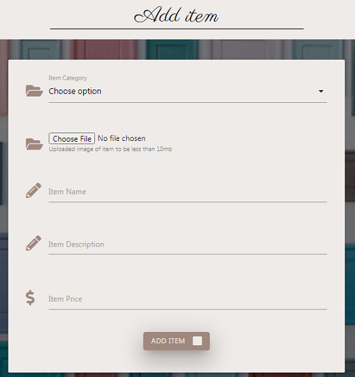

4. User goal: *be provided with an option to upload my personal information so potential buyers can see who I am*</br>
This was achieved by having using a profile page which is described [above](#profile-page).

5. User goal: *be able to edit and delete all uploaded information if any changes need to be made*</br>
This was achieved by using the CRUD functions detailed [above](#crud-operations).

6. User goal: *be able to tag an item as sold so as the buyers can see how in demand my works are*</br>
This was achieved by using the sold item feature detailed [above](#sold-feature).

7. Buyer goal: *have information about the item being sold in one place for convenience of use*</br>
This was achieved by using the items cards detailed [above](#item-cards).

8. Buyer goal: *have the ability to view items by search criteria inorder to narrow down item list to specific requirements*</br>
This was achieved by using the search bar detailed [above](#search-bar-and-pagination).

9. Site owner: *be able to edit and delete any loaded information for content control purposes.*</br>
This was achieved by allowing full CRUD operations to the admin as detailed [above](#crud-authorisation).

10. Site owner: *have full access to all uploaded information in one convenient place for CRUD operations*</br>
This was achieved by using the the [control center](#control-center) and tested by myself.

The above user goals were further tested by obtaining feedback from an artist. The feedback was positive all on aspects.

### Validators

Code syntax were checked for errors with the following validators:
* official W3C validator located [here](https://validator.w3.org/)
* css official validator(jigsaw) located [here](https://jigsaw.w3.org/css-validator/)
* JSHint located [here](https://jshint.com/)
* Pytlint for python code valiation

Errors were corrected and final test results are given below:

| Test                           | Expected result                | Results            |                                 
|:-------------------------------|:-------------------------------|:-------------------|
|W3C validator                   |No errors or warnings to show   |Passed              | 
|css official validator(jigsaw)  |No errors found                 |Passed              |                            
|JSHint located                  |Congratulations. No error found |Warnings present    |
|Python validator (pylint)       |No errors                       |Passed              |

For the W3C validator all errors due to jinja templates were filtered out.
The error 'Doctype must be declared' first was also ignored.

The Jshint test results had the warning " 'let' is available in ES6 (use 'esversion: 6') or Mozilla JS extensions (use moz)." was due to
syntax used for defining variables.

### Chrome DevTools

Chrome DevTools were used extensively during development phase to assist in:
* page layout issues 
* checking errors
* debugging
* verifying correct output using console  

### Site testing

The site was tested by myself and once the main site was completed it was further tested by having an artist 
register and use the site. The feedback obtained was positive.

### Responsive design

The site was viewed on different device sizes to check for correct reponsive design. This was done using primarily
Chrome DevTools with different emulated devices(moto G4, iphone 6/7/8, ipad, ipad pro). The responsive viewer chrome 
extension was also used. Resolutions covered are as follows:

|Screen resolution| Device                        |
|:----------------|:------------------------------|
|1280 X 800       |large screen                   |
|1024 X 800       |medium screen                  |
|768 X 1024       |ipad                           |
|414 X 736        |iPhone 8 Plus, 7 Plus, 6S Plus |
|375 X 667        |iPhone 8, 7, 6S, 6             |
|414 X 896        |iPhone XR, XS Max              |
|375 X 812        |iPhone XS, X                   |
|412 X 846        |Galaxy S9 Plus, S8 Plus        |
|360 X 740        |Galaxy S9, Note 8, S8          |
|323 X 786        |Pixel 3, 3 XL                  |

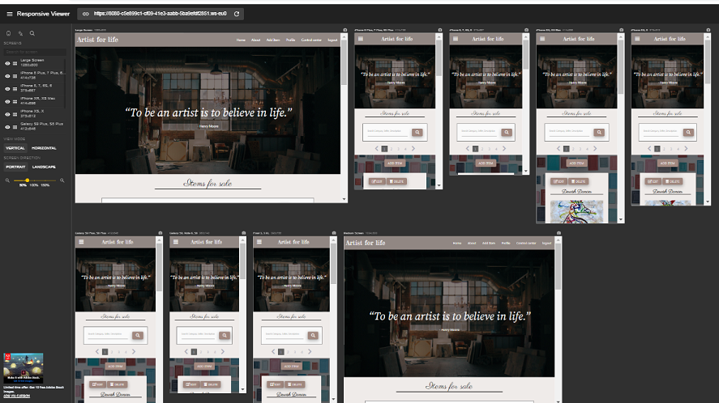

A final check was done using the website http://ami.responsivedesign.is/. 

### Browser compatibility

The site was tested on Google Chrome, FireFox, Internet Explorer, Safari and Opera.

### Button and link testing

The following gives test results for button and link testing not related to CRUD operations.

|links                            |Expected result                                         | Results |                                 
|:--------------------------------|:-------------------------------------------------------|:--------|
|Register                         |Register modal to open                                  |Passed   |
|Register submit(correct data)    |Flash message "You have been registered"                |Passed   |                                           
|Register submit(incorrect data)  |Flash message error mesae and modal to reopen           |Passed   |
|Login submit(correct data)       |Flash message "You have been logged in"                 |Passed   |
|Login submit(incorrect data)     |Flash error message and modal to reopen                 |Passed   |
|here text on modals              |Login/Register Modals to switch over                    |Passed   |
|Logout                           |Flash message "You have been logged out"                |Passed   |
|About                            |About Modal to open up                                  |Passed   |
|Close on about modal             |About modal to close                                    |Passed   |
|Artist for life logo             |Main index html page to load                            |Passed   |
|Artist for life logo             |Main index html page to load                            |Passed   |
|Control center                   |Control center html  page to load                       |Passed   |
|Profile                          |Profile html page to load                               |Passed   |
|Add item                         |Add item html form page to load                         |Passed   |
|Edit item                        |Edit item html form page to load                        |Passed   |
|Create profile                   |Add profile html form page to load                      |Passed   |
|Edit profile                     |Edit profile html form page to load                     |Passed   |
|Edit Contact details             |Edit contact html form to load                          |Passed   |
|Mark as sold                     |Sold banner text to appear on item                      |Passed   |
|Mark as available                |Sold banner text to be removed from item                |Passed   |
|Seller profile                   |Profle page to load for that user                       |Passed   |
|chevron arrows                   |Loading of next or previous page                        |Passed   |
|pagination numbers               |Loading of selected page                                |Passed   |
|search button                    |Search page to load with relevant search results        |Passed   |
|Reset search                     |Main item page to load                                  |Passed   |
|Palette icon                     |Wikepedia page to open in seperate page                 |Passed   |

### Crud operation testing

The following table summarises CRUD operation testing

|Button            | Location              |Expected result                                               | Results |                                 
|:-----------------|:----------------------|:-------------------------------------------------------------|:--------|
|Submit            | Registration modal    |user information to be added to users collections in mongodb  |Passed   |
|Add item          | Add item form page    |Item added to items collections in mongodb                    |Passed   |
|Add profile       | Add profile form page |Profile added to profiles collections in mongodb              |Passed   |
|Confirm           | Edit item form page   |Item updated in items collections in mongodb                  |Passed   |
|Confirm           | Edit profile form page|Item updated in profiles collections in mongodb               |Passed   |
|Delete            | items main page       |Item removed from items collections in mongodb database       |Passed   |
|Delete            | Profile main page     |Item/profile removed from items/profile collections in mongodb|Passed   |
|confirm           | Edit contact form page|Contact details to be updated in users collections in mongodb |Passed   |
|confirm           | Edit contact form page|Contact details to be updated in users collections in mongodb |Passed   |
|Add category      | Control center page   |New category to be added to categories collections in mongod  |Passed   |
|Confirm           | Edit category page    |Category to be updated to categories collections in mongod    |Passed   |
|Mark as sold      | Profile html page     |Sold field upadted to "true"                                  |Passed   |
|Mark as available | Profile html page     |Sold field upadted to "false"                                 |Passed   |

During item deletion/editing it was checked to see that image data was removed/updated from fs.files and fs.chunks also.

### Issues Encountered during development

During testing phase the following issues were indentified and corrected.

1. Once a specific card was exposed it could be selected again causing the card game logic to breakdown. This was 
resolved by adding the condition ```(($(this).attr("class")).length)>=6)``` in the click function. 

2. The Star Wars character funfact at the end of the game would not show up if a status other than 200 was obtained.
To cater for this issue a defensive design was implemented by including an else if statement in the getData function so that if a status other than 200 was obtained
a default character fact would appear. Character chosen was Luke Skywalker. This was further tested by providing an incorrect URL to the getdata function 
and checking the output.</br>
For the character-info.html page 'data unavailable' would appear in the fields.</br> 


3. On the level select modal the play button could be pressed without a level being selected. To fix this bug
a condition was added, ```if($("input[type=radio][name=level]:checked").length===1)```, to activate the play button only when a level was selected and the "choose your difficulty level" text 
was made to blink so as to prompt the user.

4. After completing the game and pressing the restart button, two modals would superimpose on each other. This bug was fixed
by hiding the 'gameEnd' module if the restart button is pressed.

5. Each star wars character had its own character class which produced alot of repetition for only a change in image URL. To avoid having
to repeat each character class, consuming large amount of css lines, a solution was found whereby the background-image URL was added 
with Javacsript once the card was selected. This provided a more efficient style sheet.

6. Once the main game was completed and testing peformed it was noticed that the play again button was hidden on the game end modal.
This was adjusted by increasing modal height from 270px to 310px.</br>


7. When the game was completed and the fun facts would appear it would briefly show the previous character info. This issue
was addressed by adding a loading bar gif when ever the fun facts function was called and no repsonse from the API had been obtained yet.

8. While checking for browser compatibility it was found that the footer was not fixed to the bottom on IE browser. This issues was corrected 
by changing ```flex: 1``` to ```flex-grow: 1```.</br>


9. Another issue noticed while performing browser compatibility test was the scroll function did not work on IE and was abrupt on safari.
After consulting documentation from [W3schools](https://www.w3schools.com/howto/howto_css_smooth_scroll.asp#section2) it was observed that
the scroll function was not supported on these browsers. A modification was attempted using the animate function however this also produced
abrupt screen movement. Consequently, the Choice was made to revert back to the original code. 

10. While testing for reponsiveness using chrome dev tools it was noticed that the text below logo would change lines on smaller devices.
This issue was addressed by changing font size.</br>


11. After final project review it was decided to add instructions on how to play the game. This was achieved by adding a link to  the header which directs to a wikepdia [page](https://en.wikipedia.org/wiki/Matching_game) containing generic rules on how to play. 

# DEPLOYMENT

Gitpod was used as an online IDE and then pushed to GITHUB for [hosting](https://zahur76.github.io/MilestoneProject_2/).

To deploy the project on github pages the following steps were used:
1. Login to Github and select the the MilestoneProject_2 repository.
2. Press the setting button on the top menu bar located on the right-hand side.</br>


3. Scroll down to the Github pages section and select Master branch from the dropdown menu and press save.</br>


4. Once completed an active link is published for the repository. 

To run code locally the following steps should be performed:
1. On GitHub, navigate to the main page of the repository.
2. Above the list of files, click  Code and copy URL.</br>

3. Open Git Bash.
4. Change the current working directory to the location where you want the cloned directory.
5. Type git clone, and then paste the URL you copied earlier.</br>
    $ git clone https://github.com/zahur76/MilestoneProject_2
6. Press Enter to create your local clone.

## FUTURE IMPROVEMENTS

Add a countdown timer option to add another level of difficulty to the game. The user would be able to specify both
a difficulty level and a time limit inorder to complete the game.

## CREDITS

### Content

* [wikepedia](https://en.wikipedia.org/wiki/Matching_game) was used as source for rules.
* Star Wars character facts obtained from open source [swapi](https://swapi.dev/).
* dev.to was consulted to assist in footer [placement](https://dev.to/amjadmh73/the-best-way-to-keep-the-footer-at-the-bottom-of-your-web-page-32ek).

### Media

* The following fonts were used from [google font](https://fonts.google.com/):
    - Roboto
    - Orbitron 
    - Press Start 2P
* Sound clips were obtained from [101 soundboard](https://www.101soundboards.com/).
* Card images were purchased from [mintParcel](https://www.mintparcel.com).
* Logo obtained from [flaming text](https://flamingtext.com/).
* Icons for home, social media and galactic senate were obtained from [font awesome](https://www.fontawesome.com).
* Loading gif was obtained from [icons8](https://icons8.com/).

### Acknowledgment

* I would like to thank zara meerun, sofia meerun and behlal meerun for testing the game and also my mentor 
Allen Thomas Varghese for his input during the mentor sessions.
